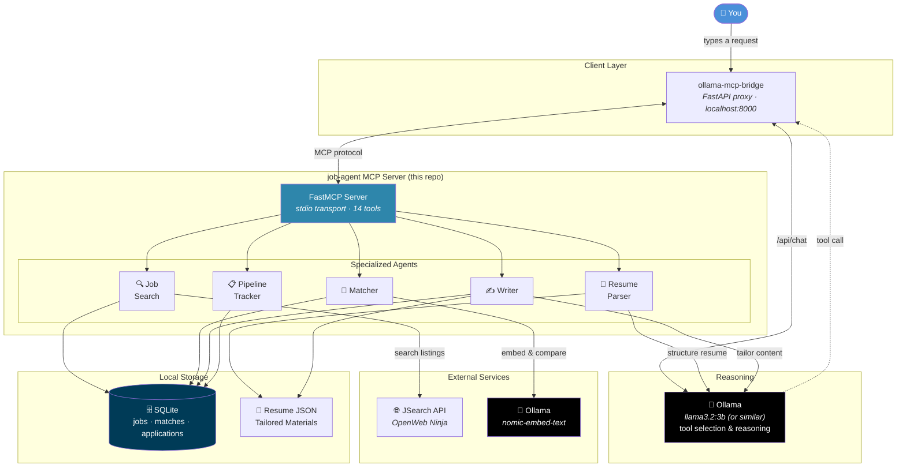
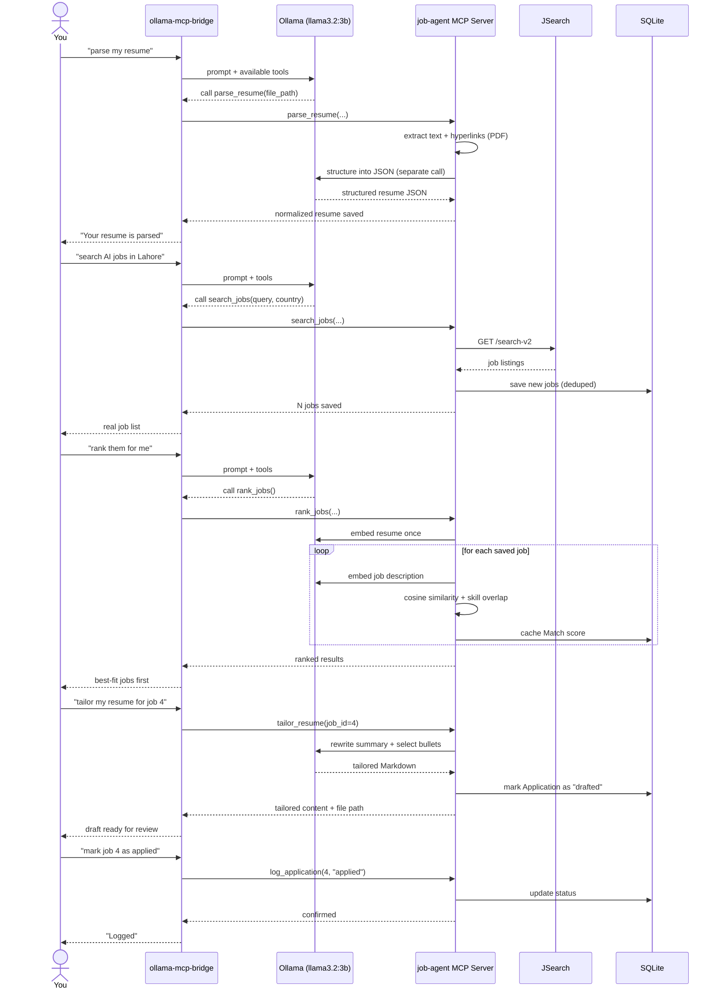

<div align="center">


<br/>

**An autonomous, multi-agent job-hunting system exposed as an MCP server — running entirely on local, open-weight LLMs.**

<br/>

[](https://www.python.org/)
[](https://gofastmcp.com)
[](https://ollama.com)
[](https://www.sqlite.org/)
[](#license)

<br/>


<br/><br/>

*Parse your resume → search real jobs → rank them by fit → tailor your application → track your pipeline — all through natural conversation with a local model, no cloud LLM required.*

<br/>

</div>

---

<div align="center">

### ⚡ Local AI · Multi-Agent Architecture · MCP · Job Intelligence

```text
┌─────────────┐     ┌──────────────┐     ┌──────────────┐
│   Resume    │ ──▶ │  Job Search  │ ──▶ │    Matcher   │
│    Parser   │     │     Agent    │     │     Agent    │
└─────────────┘     └──────────────┘     └──────┬───────┘
                                                │
                                                ▼
                                        ┌──────────────┐
                                        │    Writer    │
                                        │     Agent    │
                                        └──────┬───────┘
                                               │
                                               ▼
                                        ┌──────────────┐
                                        │   Pipeline   │
                                        │    Tracker   │
                                        └──────────────┘
```

</div>

---

## 📑 Table of Contents

* [Overview](#overview)
* [Architecture](#architecture)
* [Agents & Tools](#agents--tools)
* [Tech Stack](#tech-stack)
* [Project Structure](#project-structure)
* [Getting Started](#getting-started)
* [Usage](#usage)
* [Data Flow: A Full Job-Hunt Cycle](#data-flow-a-full-job-hunt-cycle)
* [Design Decisions](#design-decisions)
* [Known Limitations](#known-limitations)
* [Roadmap](#roadmap)
* [License](#license)

---

# 🚀 Overview

`job-agent-mcp` is a **FastMCP server** that turns a local Ollama model into a multi-agent job-hunting assistant.

Instead of one monolithic chatbot, the system is built as **five specialized agents** — each with a narrow, well-defined job — coordinated through the Model Context Protocol (MCP).

<div align="center">

|          Agent          | Responsibility                                                                            |
| :---------------------: | ----------------------------------------------------------------------------------------- |
|   📄 **Resume Parser**  | Extracts a normalized, structured JSON profile from your PDF/DOCX resume                  |
|    🔍 **Job Search**    | Queries live job listings (LinkedIn, Indeed, Glassdoor, and more via JSearch)             |
|      🎯 **Matcher**     | Scores saved jobs against your resume using semantic embeddings                           |
|      ✍️ **Writer**      | Drafts tailored resume content and cover letters per job                                  |
| 📋 **Pipeline Tracker** | Tracks each application through saved → drafted → applied → interviewing → offer/rejected |

</div>

### 🔒 Local-First Architecture

Everything runs **locally** — resume parsing, embeddings, and writing all go through Ollama on your own machine.

The only external network call in the whole system is the **job search API itself**.

```text
Your Machine
│
├── 🧠 Ollama
│   ├── LLM
│   └── Embedding Model
│
├── 🔌 MCP Server
│   ├── Resume Parser
│   ├── Job Search
│   ├── Matcher
│   ├── Writer
│   └── Pipeline Tracker
│
└── 🗄️ Local Storage
    ├── SQLite
    └── Resume / Application Files

             │
             ▼

       🌐 JSearch API
       External Job Data
```

---

# 🏗️ Architecture



### 🔌 Why a Bridge?

Ollama doesn't natively speak MCP.

`ollama-mcp-bridge` sits in between, injecting available MCP tools into Ollama's `/api/chat` endpoint and routing tool calls to the actual MCP server over stdio.

```text
                 ┌──────────────────────┐
                 │        User          │
                 └──────────┬───────────┘
                            │
                            ▼
                 ┌──────────────────────┐
                 │ ollama-mcp-bridge    │
                 │    localhost:8000    │
                 └───────┬───────┬──────┘
                         │       │
                /api/chat│       │MCP
                         ▼       ▼
                 ┌──────────┐ ┌──────────┐
                 │  Ollama  │ │ FastMCP  │
                 │   LLM    │ │  Server  │
                 └──────────┘ └──────────┘
```

---

# 🧩 Agents & Tools

<table>
<tr>
<th>Agent</th>
<th>Tool</th>
<th>Purpose</th>
</tr>

<tr>
<td rowspan="3">📄 <b>Resume Parser</b></td>
<td><code>parse_resume</code></td>
<td>PDF/DOCX → normalized JSON (contact, skills, experience, projects, education)</td>
</tr>

<tr>
<td><code>get_parsed_resume</code></td>
<td>Retrieve the full structured resume</td>
</tr>

<tr>
<td><code>list_resumes</code></td>
<td>List all parsed resumes on file</td>
</tr>

<tr>
<td rowspan="3">🔍 <b>Job Search</b></td>
<td><code>search_jobs</code></td>
<td>Query JSearch (LinkedIn/Indeed/Glassdoor/etc.), dedupe, save locally</td>
</tr>

<tr>
<td><code>get_job_details</code></td>
<td>Full details for a saved job</td>
</tr>

<tr>
<td><code>list_saved_jobs</code></td>
<td>Browse everything saved so far</td>
</tr>

<tr>
<td rowspan="2">🎯 <b>Matcher</b></td>
<td><code>match_job_to_profile</code></td>
<td>Score one job against your resume (embeddings + skill overlap)</td>
</tr>

<tr>
<td><code>rank_jobs</code></td>
<td>Score and rank <i>all</i> saved jobs, best fit first</td>
</tr>

<tr>
<td rowspan="2">✍️ <b>Writer</b></td>
<td><code>tailor_resume</code></td>
<td>Rewrite summary + select relevant bullets for a specific job</td>
</tr>

<tr>
<td><code>generate_cover_letter</code></td>
<td>Draft a job-specific cover letter</td>
</tr>

<tr>
<td rowspan="3">📋 <b>Pipeline Tracker</b></td>
<td><code>log_application</code></td>
<td>Record status: applied / interviewing / offer / rejected / withdrawn</td>
</tr>

<tr>
<td><code>get_application_status</code></td>
<td>Check where one application stands</td>
</tr>

<tr>
<td><code>list_pipeline</code></td>
<td>View your whole pipeline, optionally filtered by status</td>
</tr>

<tr>
<td>🩺 <b>Utility</b></td>
<td><code>ping</code></td>
<td>Health check — confirms the server is alive and reachable</td>
</tr>

</table>

---

# 🛠️ Tech Stack

| Layer                   | Technology                                                                           |
| ----------------------- | ------------------------------------------------------------------------------------ |
| **MCP Server**          | [FastMCP](https://gofastmcp.com) (Python)                                            |
| **LLM Runtime**         | [Ollama](https://ollama.com) — local, open-weight models (tested with `llama3.2:3b`) |
| **MCP ↔ Ollama Bridge** | [ollama-mcp-bridge](https://pypi.org/project/ollama-mcp-bridge/)                     |
| **Resume Parsing**      | `pdfplumber`, `python-docx` + Ollama structuring                                     |
| **Job Search**          | [JSearch API](https://www.openwebninja.com/api/jsearch) (OpenWeb Ninja)              |
| **Embeddings**          | Ollama (`nomic-embed-text`) — no separate ML framework needed                        |
| **Data Validation**     | `Pydantic`                                                                           |
| **Database**            | `SQLite` via `SQLModel`                                                              |
| **HTTP Client**         | `httpx`                                                                              |

### 💡 Lightweight by Design

No `torch`, no `sentence-transformers`, no cloud LLM API.

The entire pipeline runs on infrastructure you already have once Ollama is installed.

```text
┌─────────────────────────────────────────────┐
│              LOCAL AI PIPELINE              │
├─────────────────────────────────────────────┤
│                                             │
│  🧠 Ollama LLM                              │
│          │                                  │
│          ├── Resume Structuring             │
│          ├── Tool Selection                 │
│          ├── Resume Tailoring               │
│          └── Cover Letter Generation        │
│                                             │
│  🧠 nomic-embed-text                        │
│          │                                  │
│          └── Semantic Job Matching           │
│                                             │
│  🗄️ SQLite                                  │
│          │                                  │
│          └── Local Persistence              │
│                                             │
└─────────────────────────────────────────────┘
```

---

# 📁 Project Structure

```text
job-agent-mcp/
├── mcp-config.json          # Bridge config: how to launch this server
├── requirements.txt
├── .env.example
│
├── data/
│   ├── resumes/              # Parsed resume JSON + raw text (per resume_id)
│   ├── applications/         # Tailored resumes & cover letters (per job × resume)
│   └── db/                   # SQLite database file
│
└── server/
    ├── main.py               # FastMCP entry point — registers all tools
    ├── app.py                # Shared FastMCP instance (avoids dual-import bug)
    ├── config.py             # .env loader, path resolution
    │
    ├── models/
    │   └── resume.py         # Pydantic schema: ResumeCV and friends
    │
    ├── db/
    │   ├── models.py         # SQLModel tables: Job, Match, Application
    │   └── session.py        # Engine + session management
    │
    ├── agents/               # Core logic, framework-agnostic
    │   ├── cv_store.py       # Save/load/resolve parsed resumes
    │   ├── cv_structurer.py  # Ollama-backed resume → JSON
    │   ├── matcher.py        # Embedding similarity + skill overlap
    │   └── writer.py         # Tailored resume & cover letter generation
    │
    └── tools/                # MCP tool definitions (the public interface)
        ├── resume_extractor.py  # PDF/DOCX text + hyperlink extraction
        ├── resume_parser.py     # parse_resume, get_parsed_resume, list_resumes
        ├── job_search.py        # search_jobs, get_job_details, list_saved_jobs
        ├── matcher_tool.py      # match_job_to_profile, rank_jobs
        ├── writer_tool.py       # tailor_resume, generate_cover_letter
        └── pipeline_tool.py     # log_application, get_application_status, list_pipeline
```

---

# ⚡ Getting Started

## Prerequisites

* Python 3.10+
* [Ollama](https://ollama.com) installed and running
* A free [JSearch API key](https://app.openwebninja.com/api/jsearch) (200 requests/month on the free tier)

---

## 1️⃣ Pull the Models You Need

```bash
ollama pull llama3.2:3b        # or any tool-calling-capable model your hardware supports
ollama pull nomic-embed-text   # for the matcher agent's embeddings
```

---

## 2️⃣ Install the Project

```bash
git clone <this-repo-url>
cd job-agent-mcp

python3 -m venv venv
source venv/bin/activate        # Windows: venv\Scripts\activate

pip install -r requirements.txt
```

---

## 3️⃣ Configure

```bash
cp .env.example .env
```

Edit `.env`:

```ini
JSEARCH_API_KEY=your_openwebninja_api_key_here
JSEARCH_BASE_URL=https://api.openwebninja.com/jsearch
OLLAMA_HOST=http://localhost:11434
OLLAMA_MODEL=llama3.2:3b
EMBEDDING_MODEL=nomic-embed-text
```

---

## 4️⃣ Put Your Resume in Place

```bash
cp /path/to/your_resume.pdf data/resumes/
```

---

## 5️⃣ Sanity-Check the Server

```bash
python -m server.main
```

You should see the FastMCP startup banner.

`Ctrl+C` once confirmed — this was just a smoke test.

---

## 6️⃣ Connect It to Ollama via the Bridge

`ollmcp` (the more common Ollama↔MCP client) depends on `tty`/`termios`, which don't exist on Windows.

This project uses **`ollama-mcp-bridge`** instead — a FastAPI proxy that works identically across platforms.

```bash
pip install ollama-mcp-bridge
ollama-mcp-bridge --config mcp-config.json
```

This starts on:

```text
http://localhost:8000
```

and connects to your MCP server while proxying to Ollama.

---

# 💬 Usage

Talk to it via the bridge's chat endpoint:

```bash
curl -X POST "http://localhost:8000/api/chat" \
  -H "Content-Type: application/json" \
  -d '{
    "model": "llama3.2:3b",
    "messages": [{"role": "user", "content": "parse my resume at data/resumes/your_resume.pdf"}]
  }'
```

---

## 🗣️ Conversational Workflow

Once your resume is parsed, keep going conversationally:

```text
"search for AI engineer jobs in Lahore"

        ↓

"rank my saved jobs by how well they match my resume"

        ↓

"tailor my resume for job 4"

        ↓

"generate a cover letter for job 4"

        ↓

"mark job 4 as applied"

        ↓

"show me my whole pipeline"
```

> **Tip:** Always check the bridge's terminal log after a tool call. Small local models will occasionally fabricate a plausible-looking answer if a tool call actually failed — the log is the source of truth, not the chat response.

---

# 🔄 Data Flow: A Full Job-Hunt Cycle



---

# 🧠 Design Decisions

A few choices worth explaining, since they weren't the obvious defaults:

### 1. Embeddings via Ollama

* Avoids pulling in `torch` (multi-GB) for a CPU-only setup
* Reuses the Ollama instance already running for everything else

### 2. PDF Hyperlinks Over Text Parsing

Resumes often render email/LinkedIn/GitHub as icon+text, and the icon extracts as garbage glyphs.

Reading the actual hyperlink *target* (`mailto:`, `tel:`, `github.com/...`) sidesteps that entirely and is far more reliable than asking a small model to parse messy header text.

### 3. Deterministic Fallbacks

Contact fields use a priority order:

```text
PDF hyperlinks
      ↓
Regex
      ↓
LLM guess
```

This avoids trusting the model alone for anything with a predictable format.

### 4. `resolve_cv()` as a Single Choke Point

Every tool accepting an optional `resume_id` funnels through one helper that treats null-like strings (`"null"`, `"none"`, `""`) the same as an actual omitted argument.

This addresses a real failure mode observed with small local models, which sometimes send the literal string `"null"` instead of JSON `null`.

### 5. Match Caching

Re-ranking after new searches only scores the **new jobs**.

Previously scored pairs return instantly from cache.

```text
New Job
  │
  ▼
Calculate Match
  │
  ▼
Store in Match Table
  │
  └─────── Future ranking
             │
             ▼
         Cache Hit ⚡
```

### 6. Human-in-the-Loop Writer

The writer agent never auto-submits anything.

Tailored materials are drafts for review — the same philosophy carries into the planned Playwright apply-assist tool (see [Roadmap](#roadmap)).

---

# ⚠️ Known Limitations

Being upfront about these, since they're inherent to running small models locally rather than bugs to fix:

### 🤖 Tool-Calling Reliability

`llama3.2:3b` occasionally fails to format a tool call correctly, or fabricates a plausible-looking answer when a tool call errors.

**Always check the bridge log, not just the chat response.**

---

### 📝 Instruction Adherence Under Constraints

Despite explicit "don't fabricate" rules in the writer agent's prompt, a 3B model has been observed adding skills/technologies not present in the source resume (e.g. inventing "LangGraph" experience).

**Tailored output should always be reviewed before use** — treat it as a first draft, not a final document.

---

### 🐌 Performance

CPU-only inference is slow.

Multi-step operations such as `rank_jobs` across many saved jobs can take several minutes.

---

### 🌐 JSearch Response Shape

The live API nests results one level deeper (`data.jobs`) than its own published docs show.

This is handled defensively in code, but serves as a reminder that third-party API docs can drift from reality.

---

# 🗺️ Roadmap

<div align="center">

| Status | Feature                                           |
| :----: | ------------------------------------------------- |
|    ⬜   | **Application-assist tool** (`start_application`) |
|    ⬜   | Post-generation validation layer                  |
|    ⬜   | Multi-page / cursor-based pagination              |

</div>

### Application-assist Tool

`start_application` — opens a job's apply page in a visible Playwright browser, auto-fills what it can confidently identify (name, email, phone, resume upload), and hands control back for manual review and submission.

Deliberately **never auto-submits**.

### Post-generation Validation

Add a validation layer for the writer agent that cross-checks generated skill mentions against the parsed resume's actual skill list before returning output.

### Pagination

Add multi-page / cursor-based pagination support in `search_jobs`.

---

# 📄 License

MIT

---

<div align="center">

### ⚡ JOB AGENT MCP SERVER

**Autonomous job hunting powered by local AI.**

<br/>


<br/>

`Local AI` · `MCP` · `FastMCP` · `Ollama` · `SQLite` · `Python`

</div>
